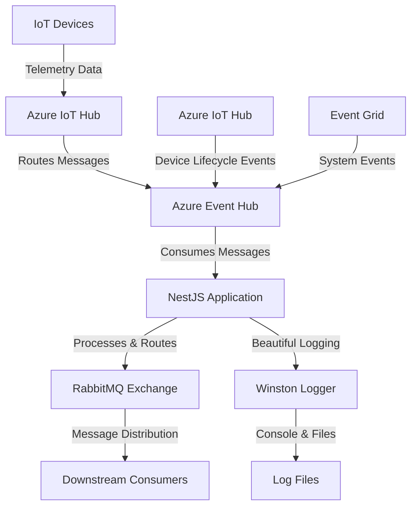

# 🚀 IoT Consumer NestJS Application

A robust NestJS application that consumes IoT messages from Azure Event Hub and forwards them to RabbitMQ with comprehensive logging and beautiful monitoring.

## 🏗️ Architecture Overview

```
IoT Devices → Azure IoT Hub → Event Hub → NestJS App → RabbitMQ → Downstream Consumers
```

### Data Flow Diagram



## 🔄 Complete Message Flow

### 1. **Data Ingestion** 📡
- **IoT Devices** send telemetry data to Azure IoT Hub
- **Azure IoT Hub** routes messages to Event Hub based on routing rules
- **Event Grid** sends device lifecycle events (connected/disconnected/created/deleted)
- **Event Hub** acts as a high-throughput message broker

### 2. **Message Consumption** 🔍
- **EventHubService** connects to Azure Event Hub using connection string
- Consumes messages from all partitions using consumer group
- Processes messages in batches (max 10 messages, 30s timeout)
- Handles different message formats:
  - **Device Telemetry**: Raw sensor data from devices
  - **Event Grid Events**: Device lifecycle events
  - **System Events**: Azure infrastructure notifications

### 3. **Message Processing** ⚙️
- **Smart Routing Logic**: Determines routing key based on message type
- **Message Parsing**: Handles JSON, Buffer, and string formats
- **Data Enrichment**: Adds metadata like partition ID, sequence number, timestamp
- **Error Handling**: Graceful handling of malformed messages

### 4. **Message Publishing** 📤
- **RabbitService** publishes processed messages to RabbitMQ
- **Exchange Management**: Creates/verifies topic exchange (`iot.events`)
- **Queue Binding**: Binds queues with routing keys (`device.*`, `device.telemetry`)
- **Message Persistence**: Messages are durable with TTL configuration

### 5. **Monitoring & Logging** 📊
- **Beautiful Logging**: Emoji-rich structured logs with Winston
- **Real-time Stats**: Message counters and error tracking
- **File Logging**: Daily rotating log files with different levels
- **Health Monitoring**: REST endpoints for system status

## 🛠️ Technical Stack

- **Framework**: NestJS (Node.js)
- **Event Hub**: Azure Event Hubs SDK
- **Message Broker**: RabbitMQ with AMQP
- **Logging**: Winston with daily rotation
- **Language**: TypeScript
- **Runtime**: Node.js

## 📋 Environment Configuration

```env
# Azure Event Hub Configuration
EVENTHUB_CONNECTION_STRING=Endpoint=sb://your-namespace.servicebus.windows.net/;SharedAccessKeyName=RootManageSharedAccessKey;SharedAccessKey=your-key
EVENTHUB_NAME=your-event-hub-name
EVENTHUB_CONSUMER_GROUP=$Default

# RabbitMQ Configuration
RABBIT_PROTOCOL=amqp
RABBIT_HOSTNAME=localhost
RABBIT_PORT=5672
RABBIT_USERNAME=guest
RABBIT_PASSWORD=guest
RABBIT_EXCHANGE_NAME=iot.events
RABBIT_EXCHANGE_TYPE=topic
RABBIT_QUEUE_NAME=reflect.service
RABBIT_BINDING_KEYS=device.*,device.telemetry,test.*
RABBIT_MESSAGE_TTL=300000
RABBIT_PREFETCH_COUNT=10
RABBIT_HEARTBEAT=10

# Application Configuration
PORT=5001
LOG_LEVEL=info
LOG_RETAIN_PERIOD=1d
```

## 🚀 Getting Started

### Prerequisites
- Node.js 18+ 
- RabbitMQ server running
- Azure Event Hub configured
- Azure IoT Hub with routing to Event Hub

### Installation

```bash
# Clone the repository
git clone <repository-url>
cd updated-iot-consumer-nest

# Install dependencies
npm install

# Copy environment file
cp .env.example .env

# Configure your environment variables
nano .env
```

### Running the Application

```bash
# Development mode with hot reload
npm run start:dev

# Production build
npm run build
npm start
```

## 📡 API Endpoints

### Health & Status
- `GET /` - Application health check
- `GET /health` - Detailed system status

### Testing Endpoints
- `POST /test-rabbit` - Test RabbitMQ with custom data
- `POST /rabbit-test-telemetry` - Test with pre-built telemetry data

### Azure IoT Integration
- `GET /new-event?deviceId=<id>&payload=<data>` - Send C2D message
- `GET /new-method?deviceId=<id>&methodName=<name>&payload=<data>` - Invoke device method

## 🎯 Message Types & Routing

### Device Telemetry
- **Source**: IoT devices sending sensor data
- **Routing Key**: `device.telemetry`
- **Payload**: Enriched with device ID, timestamp, partition info

### Device Lifecycle Events
- **Source**: Azure IoT Hub via Event Grid
- **Routing Keys**:
  - `device.connected` - Device connection events
  - `device.disconnected` - Device disconnection events
  - `device.created` - New device registrations
  - `device.deleted` - Device deletions

### System Events
- **Source**: Azure Event Grid
- **Routing Key**: `device.other`
- **Payload**: Azure infrastructure notifications

## 📊 Beautiful Logging Features

### Log Levels & Output
- **Console**: Colorized output with emojis
- **Files**: Daily rotating logs in `logs/` directory
  - `combined-logs/` - All logs
  - `error-logs/` - Error logs only
  - `exceptions/` - Exception logs
  - `rejections/` - Promise rejection logs

### Log Examples

#### Connection Logs
```
🔌 Connecting to RabbitMQ... {
  host: "localhost",
  port: "5672",
  protocol: "amqp",
  username: "guest"
}
✅ Connected to RabbitMQ successfully
```

#### Message Publishing Logs
```
📤 Publishing message to RabbitMQ {
  messageId: "msg_1703123456789_abc123",
  exchange: "🔀 iot.events",
  routingKey: "🎯 device.telemetry",
  size: "234 bytes",
  durable: "✅",
  ttl: "300000ms",
  payloadPreview: "📄 {\"deviceId\":\"sensor-001\",\"temperature\":23.5}",
  timestamp: "2024-01-15T10:30:45.123Z"
}
```

#### Statistics Logs
```
Stats: 50 received, 48 sent to RabbitMQ, 2 errors
```

## 🧪 Testing the Complete Flow

### 1. Test RabbitMQ Connection
```bash
curl -X POST http://localhost:5001/test-rabbit \
  -H "Content-Type: application/json" \
  -d '{
    "deviceId": "test-device-001",
    "temperature": 25.5,
    "humidity": 60.2,
    "timestamp": "2024-01-15T10:30:45.123Z"
  }'
```

### 2. Test Pre-built Telemetry
```bash
curl -X POST http://localhost:5001/rabbit-test-telemetry \
  -H "Content-Type: application/json"
```

### 3. Monitor Logs
Watch the beautiful logging output in your terminal or log files to see the complete message flow.

## 🔧 Configuration Details

### RabbitMQ Topology
- **Exchange**: `iot.events` (topic type, durable)
- **Queue**: `reflect.service` (durable)
- **Bindings**: Multiple routing keys for different message types
- **TTL**: 300 seconds (5 minutes) by default
- **Prefetch**: 10 messages per consumer

### Event Hub Settings
- **Consumer Group**: `$Default`
- **Batch Size**: 10 messages maximum
- **Wait Time**: 30 seconds maximum
- **Start Position**: Current time (new messages only)

### Logging Configuration
- **Retention**: 1 day by default
- **Rotation**: Daily at midnight
- **Compression**: Gzip compression for old logs
- **Max Size**: 20MB per file

## 🚨 Error Handling

### Connection Errors
- Automatic retry for RabbitMQ connection failures
- Graceful handling of Event Hub connection issues
- Detailed error logging with stack traces

### Message Processing Errors
- Malformed messages are logged and skipped
- Failed RabbitMQ publishes are retried
- Statistics tracking for error rates

### Graceful Shutdown
- SIGINT/SIGTERM handling
- Proper cleanup of connections
- Final statistics logging

## 📈 Monitoring & Metrics

### Real-time Statistics
- Total messages received
- Successfully published to RabbitMQ
- Error count and types
- Processing rate

### Health Checks
- Application status
- RabbitMQ connectivity
- Event Hub connectivity
- System resource usage

## 🔒 Security Considerations

- Connection strings stored in environment variables
- No hardcoded credentials
- Secure message transport (AMQP)
- Proper error handling to prevent information leakage

## 🚀 Production Deployment

### Environment Setup
1. Configure production environment variables
2. Set up RabbitMQ cluster for high availability
3. Configure Azure Event Hub with appropriate scaling
4. Set up log aggregation and monitoring

### Scaling Considerations
- Horizontal scaling with multiple instances
- RabbitMQ clustering for message distribution
- Event Hub partitioning for parallel processing
- Load balancing for API endpoints

## 📚 Additional Resources

- [Azure Event Hubs Documentation](https://docs.microsoft.com/en-us/azure/event-hubs/)
- [RabbitMQ Documentation](https://www.rabbitmq.com/documentation.html)
- [NestJS Documentation](https://docs.nestjs.com/)
- [Winston Logging](https://github.com/winstonjs/winston)

---

**Built with ❤️ using NestJS, Azure Event Hub, and RabbitMQ**